# Sonic Jam

Sonic Jam is a loop-oriented, multi-player framework for making music with [Sonic Pi](http://sonic-pi.net/).  Players turn on and off grid cells representing synths or samples.  A cursor sweeps with the beat across the grid, playing any cells that are on.  Rows (tracks) can be parameterized to change the sound of a synth or sample.

Tracks can also represent sub-grids which contain their own tracks and parameters.  A sub-grid will be activated when the parent track is on.  Sub-grids have contain their own sub-grids and so forth.

#### This is what it looks like

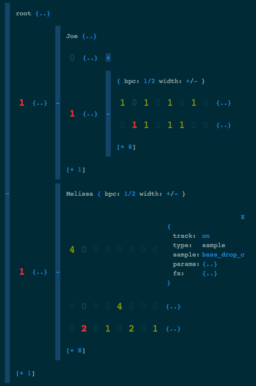

# Quick Start

1. Start [Sonic Pi](http://sonic-pi.net/).
2. Download and run Sonic Jam  ([osx](https://github.com/josephburnett/sonic-jam/raw/v0.1/release/sonic-jam-osx)).
3. Open [http://localhost:8080](http://localhost:8080)

# How to Jam

Click on a cell to toggle it on (`1`) and off (`0`).

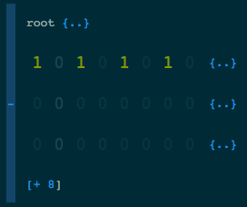

Click on the properties icon `{..}` at the end of a track to add a synth or sample.  It will be played when the cursor is on a cell which is on.

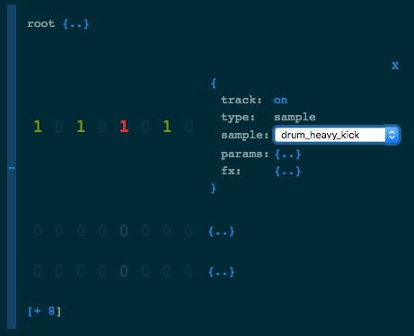

Click on the track builder `[+ 8]` to add new tracks.  Pro tip: click on the `+` to show more options; click on the `8` to add another track of the same length.

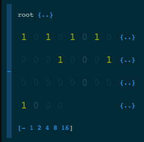

Click on the properties icon `{..}` at the top of a grid to change the beats-per-sample (`bpc`) and to change the grid width (`+/-`).

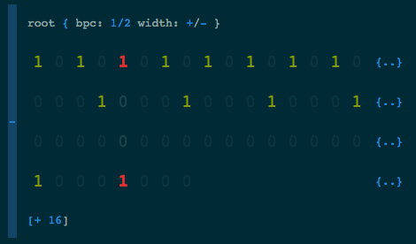

You can add parameters (`params`) to a synth or sample in the track properties.  Look at the Sonic Pi help pages for each synth or sample to see supported parameters.

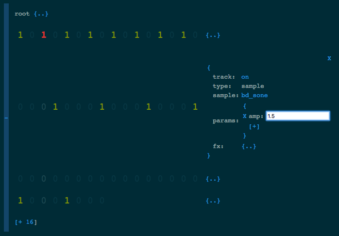

You can add effects (`fx`) to a track in the track properties.  Effects are applied in the order in which they are added.  You can parameterize effects, just like synths and samples.  See Sonic Pi help pages for supported parameters.

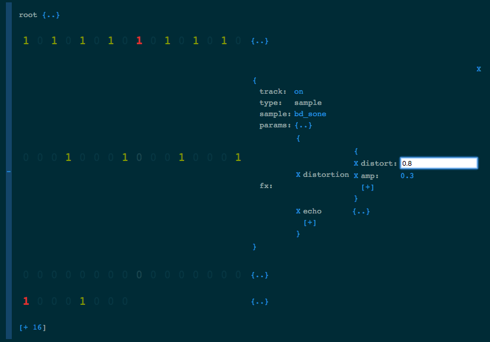

## Sub-grids

In addition to synth and sample tracks, you can create grid tracks which contain an entirely separate sub-grid.  The sub-grid will be played when the cursor is at a cell which is on.

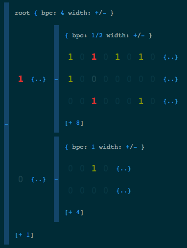

Sub-grids tracks have their own parameters and effects.  However the tracks in a sub-grid can inherit some parameters and effects from their containing (parent) track.  For example, a parent track which has a sub-grid type (`grid-type`) of `sample` will cause all tracks in the sub-grid to be interpreted as sample tracks.  Parameters which are set on the parent track, such as `pitch`, will apply to all the sub-grid tracks (unless they have an `pitch` parameter of their own.)

## Lambdas

Parameters are what make Sonic Pi synths and samples interesting to play with.  In addition to providing a scalar value, you can provide a function (lambda) which will be evaluated each time the track is played.  Any parameter which starts with the `\` character is interpreted as a lambda.

The lambda could do anything from returning a random value to increasing its value over time.  The evaluation context is the same as the Sonic Pi editor except that two additional values are in scope: 1) `beat_index` which is the zero-based index at which the cursor (beat) is in the track and 2) `row_index` which is the zero-based index at which the track is in the grid.  `beat_index` can be used to change the parameters of a track over time, restarting at the end of each loop.  `row_index` can be used to implement something like a piano roll (see Patterns below.)

### Twinkle, Twinkle Little Star

#### Organized into two parts

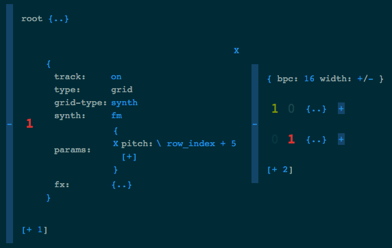

#### Part 1

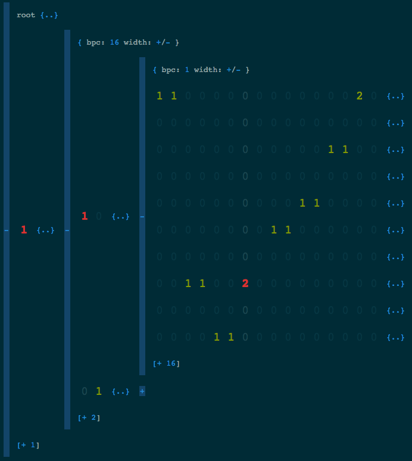

#### Part 2

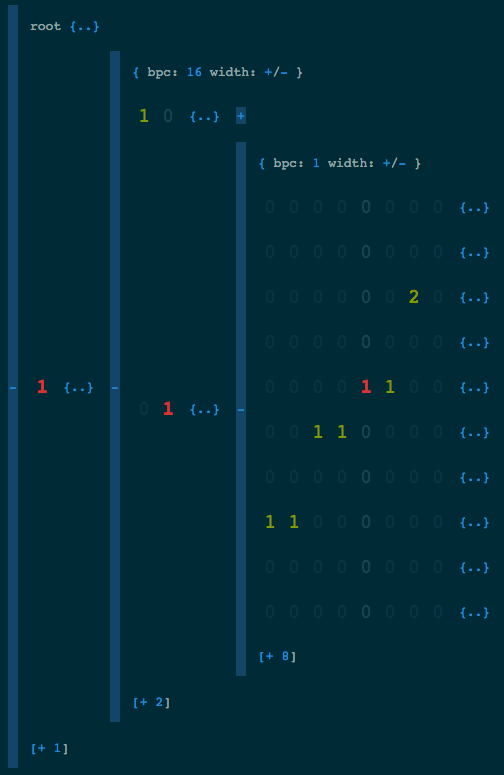

Pro tip: right-click on a cell to make a synth sustain (`2`, `3`, ...)

# Patterns

## The piano roll

When building a melody it is useful to have the tracks of a grid represent the notes of a scale.  This can be done by parameterizing a parent track with a lambda which calculates `pitch` based on `row_index`.

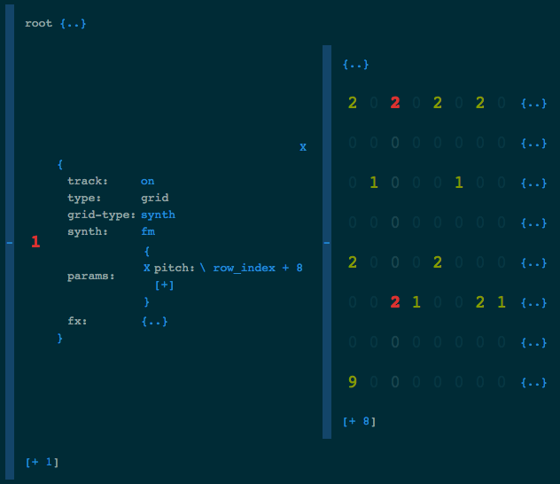

## Multiplayer jamming

Sonic Jam is built from the ground-up to support multiple players.  For example, two players can jam on the same instance by visiting the same URL in their browser.  Changes to one will immediately take effect in the other.

Sub-grids can be used to give each player their own space to work in.  The players can take turns (call-and-response) or play together.

#### Together

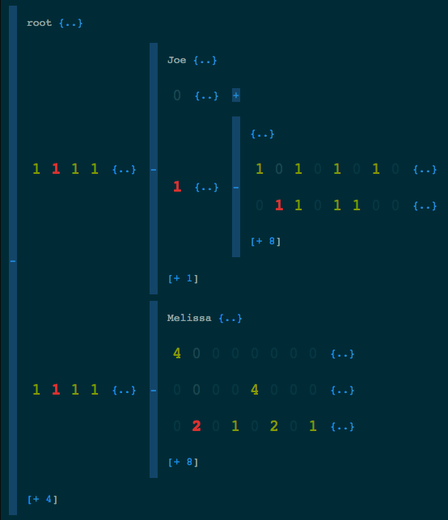

#### Call and response

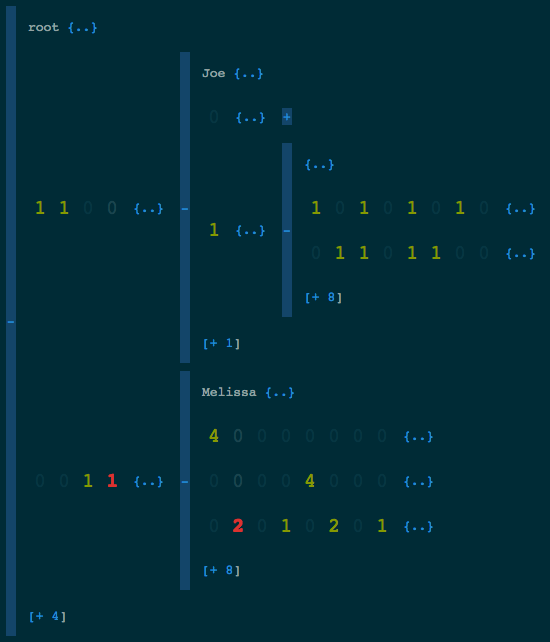

# Architecture

Sonic Jam is a framework for controlling Sonic Pi.  It uses a single live-loop to sweep through a data structure, dispatching parameterized calls to the Sonic Pi functions `synth` and `sample` on the beat.

## Data model and state

Server state is kept in the Sonic Pi variable `_state` which is a [`SonicJam::State`](https://github.com/josephburnett/sonic-jam/blob/master/sonic-pi/lib/sonicjam/state.rb) instance.  The granularity of state manipulation is a single grid through the `set_state` and `get_state` methods.

```
{
  root: {
    bpc: 1,
    tracks: [
      {
        type: "sample",
        sample: "bass_drop_c",
        beats: [[1], [1], [1], [1]]
      },
      {
        type: "grid",
        grid-id: "abcd",
        beats: [[1]]
    ]
  },
  abcd: {
    bpc: 1,
    tracks: [
      {
        type: "synth",
        synth: "fm",
        synth-params: {
          pitch: 20,
        }
        beats: [[1], [0], [0], [0]]
      }
    ]
  }
}
```

In the main live-loop a [`SonicJam::Dispatch`](https://github.com/josephburnett/sonic-jam/blob/master/sonic-pi/lib/sonicjam/dispatch.rb) instance traverses the state, generating a list of materialized dispatch structures.  Dispatch is responsible for determining which tracks and sub-grids are on/off, implementing sub-grid inheritance and running lambdas to generate scalar parameter values.

#### Beat 0

```
[
  { sample: "base_drop_c" },
  { synth: "fm", params: { pitch: 20 }}
]
```

#### Beat 1

```
[
  { sample: "base_drop_c" }
]
```

#### Beat 4

```
[
  { sample: "base_drop_c" },
  { synth: "fm", params: { pitch: 20 }}
]
```

## Components

```

+----+
| UI |
+----+
   ^
   |
   V
+--------+    +-------------------+
| OSC    |    | +--------+        |
| Bridge |<---->| Jam    |  Sonic |
+--------+    | | Server |  Pi    |
              | +--------+        |
              +-------------------+
```

The [Jam Server](https://github.com/josephburnett/sonic-jam/tree/master/sonic-pi) is bootstrapped into Sonic Pi through a series OSC messages to `/run-code` on port 4557.  It starts an OSC server on port 4560.

The [OSC Bridge](https://github.com/josephburnett/sonic-jam/tree/master/osc-bridge/src/sonicjam) starts an OSC server on port 4559 and a websocket server on 4550.  It multiplexes messages from multiple clients to the Jam Server.

The [UI](https://github.com/josephburnett/sonic-jam/tree/master/sonic-jam) communicates with the OSC Bridge over a websocket connection.  It requests synth and sample lists, and transmits and receives state changes.

## Building from head

```
./bin/build
```

#### Installing dependencies

```
./bin/ubuntu-16.04-setup
```
